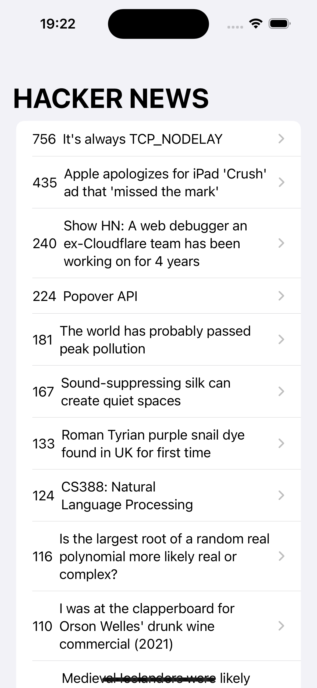
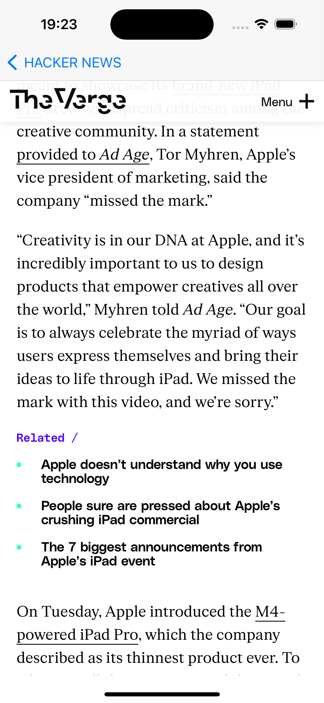

# Hacker News iOS App

This iOS app fetches technology news from the Hacker News API and displays them in a list on the main screen. When the user clicks on a news item, the app navigates to a detail screen where the news is loaded into a web view.

## Features

## Features

- Fetches technology news from the [Hacker News API](https://hn.algolia.com)

## Technologies Used

- SwiftUI

## Installation

To run this app on your iOS device or simulator:

1. Clone this repository.
2. Open the project in Xcode.
3. Build and run the app on your device or simulator.

## API Reference

This app fetches data from the Hacker News API. You can find more information about the API [here](https://hn.algolia.com/api).

## Screenshots

*Main Screen*

*Detail Screen*
